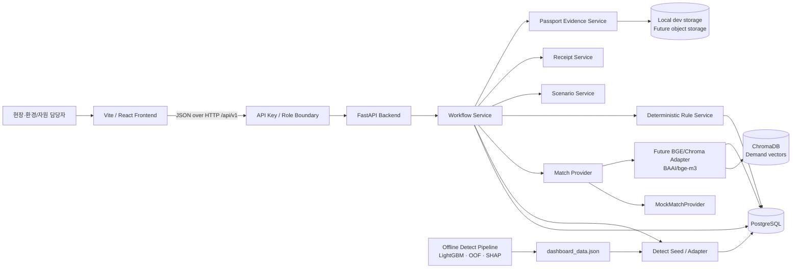

# GreenFab Loop MVP Architecture

## 1. 문서 목적

이 문서는 GreenFab Loop 해커톤 MVP의 실행 구조, 모듈별 책임, 데이터 저장 경계와 장애 처리 원칙을 정의합니다. 외부 JSON의 필드명과 의미는 [`data-contract.md`](./data-contract.md)를 우선하며, 이 문서는 해당 계약을 변경하지 않습니다.

핵심 원칙은 다음과 같습니다.

- 위험 탐지, 의미 유사도 검색, 규칙 검사와 사람의 최종 결정을 서로 분리합니다.
- PostgreSQL을 업무 상태의 단일 기준점(source of truth)으로 사용합니다.
- ChromaDB는 수요 후보의 벡터 검색에만 사용하며 업무 상태를 저장하지 않습니다.
- 데이터 출처는 `REAL`, `DEMO`, `SCENARIO`로만 구분합니다.
- AI는 `APPROVED`, `HOLD`, `REJECTED`를 결정하지 않습니다.
- Green Receipt는 내부 의사결정 스냅샷이며 법적 인증서, 불변 감사 원장 또는 실제 인계 증명이 아닙니다.

## 2. 논리 구조



## 3. 구성 요소별 책임

| 구성 요소 | 책임 | 하지 않는 일 |
| --- | --- | --- |
| Frontend | Case 조회, 사용자 입력, 단계별 결과 표시, 오류·재시도 UX | 상태 전이 우회, AI 판단 생성, 브라우저 메모리를 최종 저장소로 사용 |
| FastAPI | API, 입력 검증, 트랜잭션, 상태 전이, Provider 호출, 응답 조립 | 요청마다 Detect 모델 학습, 의미 유사도를 최종 적합성으로 해석 |
| PostgreSQL | Case, Detect provenance, 확인, Passport/Evidence metadata, Demand, Match, Decision, Scenario, Receipt, Audit, Rule policy 저장 | 벡터 최근접 검색, evidence binary 저장 |
| Offline Detect | 동일 Fold 모델 비교, LightGBM/OOF/SHAP 결과 생성 | Resource·폐기물·재활용 정보를 추론 |
| Detect Import | 검증된 Detect 산출물을 hash 기반으로 idempotent Case upsert | 원본 결과에 공정 의미를 임의 부여, 기존 Workflow 초기화 |
| BGE-M3 / ChromaDB | Passport 텍스트와 DEMO Demand 텍스트의 Top-k 의미 유사도 검색 | 안전성·성공확률·실제 산업 적합성 판단 |
| Rule Service | 수량, 필수정보, 위치 등 명시적 조건의 결정론적 검사 | LLM 기반 조건 생성, 최종 승인·거절 |
| Human Decision | 후보 선택과 `APPROVED`, `HOLD`, `REJECTED` 입력 | AI가 대신 수행할 수 없음 |
| Scenario Service | 사용자 입력값과 명시된 수식으로 후보 전환량 계산 | 검증되지 않은 탄소 감축량이나 실제 전환 실적 생성 |
| Receipt Service | 생성 시점의 전체 Case를 JSONB 스냅샷으로 기록 | 실제 물류 인계 확인, 법적 인증서 발행 |

## 4. 실행 파이프라인

1. Offline Detect Pipeline이 실제 SECOM 입력으로 위험 순위와 SHAP 결과를 생성합니다.
2. Golden seed 또는 Detect CLI가 검증 산출물을 `case`와 provenance 형식으로 PostgreSQL에 적재합니다.
3. 사람이 실제 Resource 발생 여부를 `CONFIRMED` 또는 `NOT_CONFIRMED`로 입력합니다.
4. `CONFIRMED`인 경우에만 DEMO Resource Passport를 저장합니다.
5. Backend가 Passport를 현재 설정된 Match Provider에 전달합니다.
6. Match Provider가 후보를 반환하고 Rule Service가 명시적 조건을 검사합니다.
7. Backend가 Match 실행과 후보를 하나의 트랜잭션으로 저장합니다.
8. 사람이 후보와 근거를 확인한 뒤 최종 Decision을 입력합니다.
9. Scenario Service가 `candidate_diversion_quantity`만 계산합니다.
10. Receipt Service가 전체 결정 상태를 스냅샷으로 저장합니다.

상세 상태 전이는 [`workflow.md`](./workflow.md), API 요청·응답은 [`api-contract.md`](./api-contract.md), 관계형 스키마는 [`backend-schema.md`](./backend-schema.md)를 따릅니다.

## 5. Match Provider 경계

Backend는 Match 구현에 직접 의존하지 않고 동일한 인터페이스를 사용합니다.

```text
MatchProvider.match(passport, top_k) -> MatchResult
├─ MockMatchProvider
└─ Future BGE/Chroma Adapter
```

### `MockMatchProvider`

- 백엔드와 프런트의 E2E 개발, 반복 가능한 Golden Demo에 사용합니다.
- BGE-M3로 사전 생성한 `greenfab-loop-synthetic-v1@2026-08-16` 고정 DEMO Top-3 snapshot을 결정적인 순서로 반환합니다.
- 저장된 점수는 runtime 추론값이 아니라 사전 생성된 snapshot 값이며 `model`, `model_revision`으로 출처를 구분합니다. 외부 `match.created_at`은 snapshot 생성시각이 아니라 현재 Match Run의 완료 시각입니다.
- 고정 snapshot을 실제 산업 적합성·안전성·재활용 성공확률로 해석하지 않습니다.

### Future BGE/Chroma Adapter

- 현재 PR에는 구현하지 않고 `SemanticSearchAdapter` 경계만 제공합니다.
- 서버 시작 시 BGE-M3 모델을 한 번 로드합니다.
- PostgreSQL의 DEMO Demand를 `demand_id` 기준으로 ChromaDB에 upsert합니다.
- 실제 계산된 `semantic_similarity`와 Top-k 후보를 반환합니다.
- CPU를 기본 지원하고 GPU는 환경 설정으로 선택합니다.

현재 애플리케이션은 기본 `MockMatchProvider`를 사용하며 테스트에서는 `create_app(match_provider=...)`로 Provider를 주입할 수 있습니다. 실제 BGE Adapter가 추가되면 환경 설정으로 Provider를 명시적으로 선택해야 합니다. BGE 장애 시 Backend가 조용히 Mock 결과로 대체하면 안 되며 `503 MATCH_UNAVAILABLE`로 알려야 합니다.

## 6. 데이터 저장 경계

### PostgreSQL

- Workflow 상태와 모든 사용자 입력의 단일 기준점
- Match 실행 당시 모델명, 후보, Rule 결과 보관
- 사용자 Decision과 Audit Event 보관
- Scenario 입력·결과와 Receipt 스냅샷 보관
- Detect import hash/model provenance, Evidence metadata, versioned Rule policy 보관
- API 쓰기는 트랜잭션과 상태 검사를 통과해야 함

### ChromaDB

- 검색 가능한 Demand embedding과 최소 검색 metadata만 보관
- PostgreSQL의 `demand_id`를 document ID로 사용
- 중복 insert 대신 upsert
- Case, Decision, Receipt, Audit Event를 저장하지 않음
- ChromaDB를 지워도 PostgreSQL 원본에서 재구성 가능해야 함

### 파일 산출물

- Detect 학습·OOF·SHAP은 오프라인 산출물로 관리합니다.
- 현재 seed 값은 검증된 `dashboard_data.json` 산출물에서 복사한 값이며 API 요청 중 모델을 재학습하지 않습니다.
- CLI import는 artifact hash를 기준으로 Case를 upsert하고 기존 Workflow 진행 상태를 보존합니다.
- Evidence binary는 Git/DB에 넣지 않고 개발 환경의 generated-key local storage에 저장합니다.
- 원본 SECOM 데이터와 비밀값은 Git에 포함하지 않습니다.

## 7. 출처와 해석 경계

| 단계 | MVP `source_type` | 해석 경계 |
| --- | --- | --- |
| 실제 SECOM 기반 Detect | `REAL` | 위험 순위이며 불량 확률로 단정하지 않음 |
| SHAP | `REAL` | 예측 기여도이며 원인·인과관계가 아님 |
| DEMO 현장 확인·Passport·Demand | `DEMO` | 실제 제조 현장 정보로 주장하지 않음 |
| DEMO 입력 기반 BGE-M3 Match | `DEMO` | 실제 계산값이어도 입력 출처가 DEMO이므로 DEMO |
| ESG 후보 전환량 | `SCENARIO` | 계산된 후보량이며 실제 전환·감축 실적이 아님 |

`COMPUTED`, `HUMAN`, `LOCAL` 같은 값을 `source_type`에 추가하지 않습니다. 사람의 입력 여부와 저장 상태는 별도 필드와 Audit Event로 표현합니다.

## 8. 트랜잭션과 장애 처리

- 상태 변경 API는 SQLAlchemy transaction 안에서 대상 Case를 `SELECT ... FOR UPDATE`로 잠근 뒤 현재 상태를 확인하고 관련 객체를 함께 저장합니다.
- Match 실행과 후보 저장, Decision과 Audit Event, Receipt와 스냅샷 저장은 각각 원자적으로 처리합니다.
- 잘못된 단계 요청은 `409 INVALID_STATE`로 거절합니다.
- Match와 Receipt는 선택적 `Idempotency-Key`를 지원하며 UI에서는 매번 전송하는 것을 권장합니다.
- Scenario는 Case당 하나만 저장하고 재요청 시 같은 결과를 반환합니다.
- PostgreSQL 또는 Evidence storage 접근이 실패하면 readiness가 실패합니다. 응답은 주입된 Provider class 이름도 함께 표시합니다.
- 미완성 객체를 저장하고 성공 응답을 반환하지 않습니다.
- 모든 오류 응답에는 추적 가능한 `trace_id`를 포함합니다.
- 같은 Case의 동시 상태 전이는 PostgreSQL row lock으로 직렬화합니다. 제품화 전에는 lock timeout·deadlock 관찰과 다중 worker 부하 테스트를 추가합니다.

## 9. 실행·배포 기준

로컬 MVP의 기본 실행 단위는 Docker Compose입니다.

```text
frontend     Vite/React 정적 앱 또는 개발 서버
backend      FastAPI + SQLAlchemy + Alembic
postgres     PostgreSQL
chroma       실제 BGE Provider 추가 후 선택적으로 구성
```

- 설정은 환경변수로 주입하고 `.env`는 Git에 올리지 않습니다.
- `.env.example`에는 키 이름과 안전한 예시만 둡니다.
- `/api/v1/demo/reset`은 로컬 시연에서 `DEMO_RESET_ENABLED=true`일 때만 사용하고 공개 배포에서는 기본 비활성 상태를 유지합니다.
- `GET /health/live`는 프로세스 생존 여부, `GET /health/ready`는 DB 연결과 주입된 Provider 이름을 확인합니다.
- 스키마 변경은 Alembic migration으로만 적용합니다.
- Production은 hash 기반 API key와 role을 필수로 사용합니다. SSO/OIDC, tenant,
  key lifecycle, 개인정보 처리와 백업 정책은 별도 설계해야 합니다.

## 10. MVP 비범위

- 실제 ERP/MES 연동
- 실제 기업·수요처 검증
- 물류 주문·계약·결제
- 법적 전자서명 또는 불변 원장
- 실제 인계 완료를 확인하는 외부 증빙
- 검증되지 않은 탄소·전력·폐기물 감축계수
- 멀티테넌시, SSO/OIDC와 세분화된 resource-level 권한 관리
- Evidence의 운영 object storage·malware scan·retention

## 11. 후속 구현 TODO

- 운영 SSO/OIDC·조직 tenant와 API key rotation/revocation
- 실제 `BAAI/bge-m3` CPU-first Adapter와 ChromaDB lifecycle
- Provider 선택 환경변수와 실제 모델 readiness probe
- Detect import scheduler와 MES/QMS connector
- active Rule policy version을 Match/Rule 실행 결과에 연결
- Evidence object storage, malware scan, retention/deletion worker
- 실제 인계 증빙이 필요할 경우 별도의 정책·API·법적 검토
