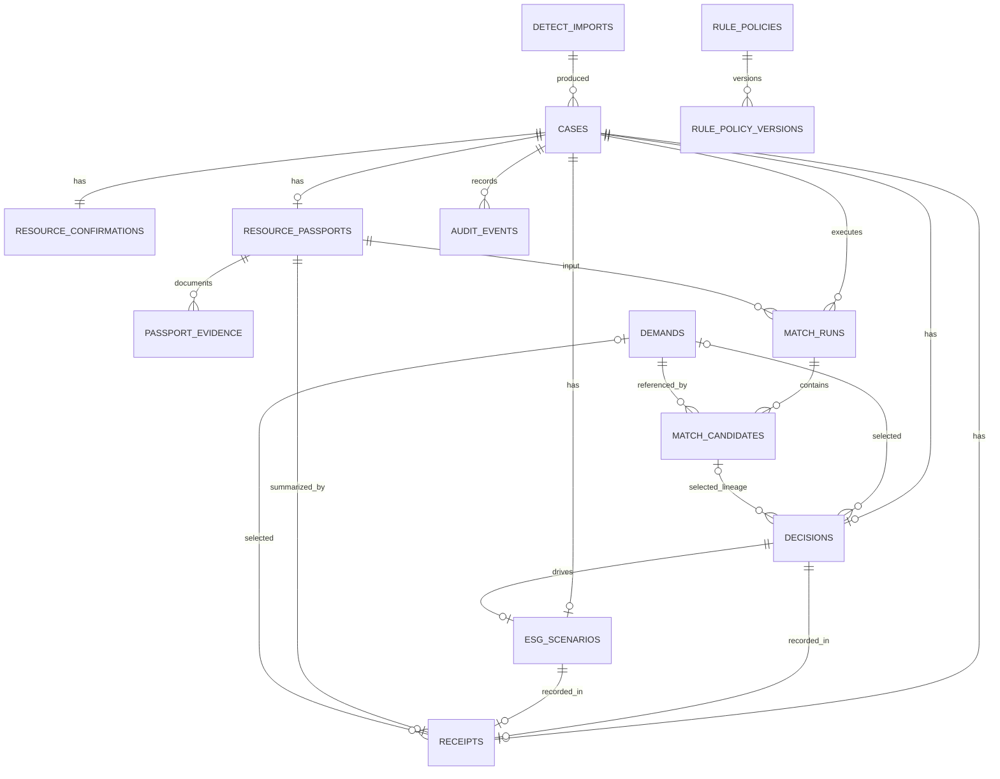

# GreenFab Loop PostgreSQL Schema v0.1

## 1. 설계 원칙

- PostgreSQL이 Workflow 업무 데이터의 단일 기준점입니다.
- 외부 JSON은 [`data-contract.md`](./data-contract.md), 상태 전이는 [`workflow.md`](./workflow.md)를 따릅니다.
- 모든 시간 컬럼은 `TIMESTAMPTZ`입니다.
- PostgreSQL에서는 모델 결과와 스냅샷 JSON을 `JSONB`로 저장합니다. 테스트 SQLite에서는 같은 SQLAlchemy type을 `JSON`으로 치환합니다.
- FK, Unique, Check Constraint로 핵심 무결성을 보장합니다.
- 스키마 변경은 Alembic migration으로 적용합니다.
- 현재 구현은 native PostgreSQL enum 대신 checked string enum을 사용합니다.

## 2. ERD



## 3. 테이블

### `cases`

| 컬럼 | 타입 | 제약·설명 |
| --- | --- | --- |
| `case_id` | `VARCHAR(64)` | PK, 예: `SECOM-0116` |
| `risk_rank` | `INTEGER` | null 또는 1 이상 |
| `shap_top_features` | `JSONB` | `[{feature_name, shap_value}]` |
| `source_type` | `VARCHAR` | `REAL`, `DEMO` |
| `workflow_status` | `VARCHAR` | 내부 Workflow 상태 |
| `detect_import_id` | `VARCHAR(64)` | FK detect_imports, 최신 Detect provenance |
| `risk_score` | `DOUBLE PRECISION` | 원 artifact의 상대 위험 score, null 가능 |
| `risk_score_type` | `TEXT` | score 해석 문구, null 가능 |
| `created_at`, `updated_at` | `TIMESTAMPTZ` | 서버 생성 |

허용 상태:

```text
DETECTED, CONFIRMATION_PENDING, RESOURCE_CONFIRMED, PASSPORT_READY,
MATCH_READY, DECIDED, SCENARIO_READY, RECEIPT_CREATED,
NOT_CONFIRMED, CLOSED
```

정상 API 흐름은 미발생 확인 시 `CLOSED`로 바로 전환합니다. `NOT_CONFIRMED` 내부 enum은 현재 저장 전이에는 사용하지 않는 예약 값입니다.

### `detect_imports`

| 컬럼 | 타입 | 제약·설명 |
| --- | --- | --- |
| `detect_import_id` | `VARCHAR(64)` | PK |
| `artifact_sha256` | `VARCHAR(64)` | UNIQUE, import idempotency key |
| `artifact_name` | `VARCHAR(255)` | basename만 저장, 절대 경로 미저장 |
| `dataset_name`, `model_name`, `model_revision` | `VARCHAR` | provenance/model metadata |
| `validation_method`, `score_type` | `TEXT` | 해석 경계, null 가능 |
| `source_type` | `VARCHAR` | `REAL`, `DEMO` |
| `case_count` | `INTEGER` | 0 이상 |
| `provenance_json` | `JSONB` | 허용된 artifact metadata·summary·metrics |
| `imported_by`, `created_at` | `VARCHAR`, `TIMESTAMPTZ` | 실행 actor와 시각 |

Case는 최신 `detect_import_id`를 FK로 연결합니다. 같은 artifact hash 재실행은 import row와
변경 없는 Case Audit를 중복 생성하지 않으며 기존 Workflow 진행 상태를 보존합니다.

### `resource_confirmations`

| 컬럼 | 타입 | 제약·설명 |
| --- | --- | --- |
| `confirmation_id` | `BIGINT` | PK, 자동 증가 |
| `case_id` | `VARCHAR(64)` | FK cases, UNIQUE |
| `status` | `VARCHAR` | `PENDING`, `CONFIRMED`, `NOT_CONFIRMED` |
| `confirmed_by` | `VARCHAR(255)` | PENDING이면 null 가능 |
| `confirmed_at` | `TIMESTAMPTZ` | PENDING이면 null 가능 |
| `source_type` | `VARCHAR` | `REAL`, `DEMO` |
| `created_at`, `updated_at` | `TIMESTAMPTZ` | 서버 생성 |

Golden Case의 확인 데이터는 서버가 `DEMO`로 생성합니다.

DB Check Constraint는 다음 완료 필드 조합을 강제합니다.

- `PENDING`: `confirmed_by`, `confirmed_at` 모두 `NULL`
- `CONFIRMED`, `NOT_CONFIRMED`: trim 후 비어 있지 않은 `confirmed_by`와 `confirmed_at` 모두 필수

### `resource_passports`

| 컬럼 | 타입 | 제약·설명 |
| --- | --- | --- |
| `passport_id` | `VARCHAR(64)` | PK |
| `case_id` | `VARCHAR(64)` | FK cases, UNIQUE |
| `description` | `TEXT` | DB null 허용, MVP API에서는 필수 |
| `quantity` | `NUMERIC(18,6)` | null 또는 0 이상 |
| `unit` | `VARCHAR(64)` | quantity와 함께 존재하거나 함께 null |
| `condition` | `TEXT` | null 허용 |
| `location` | `VARCHAR(255)` | null 허용 |
| `composition` | `TEXT` | null 허용 |
| `source_type` | `VARCHAR` | `REAL`, `DEMO` |
| `created_at`, `updated_at` | `TIMESTAMPTZ` | 서버 생성 |

DB와 API 모두 `(quantity, unit)` 양방향 pair를 강제합니다. 즉 수량만 또는 단위만 저장할 수 없으며, 단위는 trim 후 비어 있지 않아야 합니다. `description`은 DB 호환성상 null을 허용하지만 MVP API에서는 trim 후 빈 문자열을 거부합니다.

### `passport_evidence`

| 컬럼 | 타입 | 제약·설명 |
| --- | --- | --- |
| `evidence_id` | `VARCHAR(64)` | PK |
| `passport_id` | `VARCHAR(64)` | FK resource_passports, CASCADE |
| `storage_key` | `VARCHAR(255)` | UNIQUE, API 비노출 generated key |
| `original_filename`, `media_type` | `VARCHAR` | 표시 metadata |
| `size_bytes`, `sha256` | `BIGINT`, `VARCHAR(64)` | 양수 크기와 content digest |
| `evidence_type` | `VARCHAR` | `PHOTO`, `DOCUMENT`, `ANALYSIS_REPORT`, `OTHER` |
| `description` | `TEXT` | null 가능 |
| `source_type` | `VARCHAR` | `REAL`, `DEMO` |
| `uploaded_by`, `created_at` | `VARCHAR`, `TIMESTAMPTZ` | 인증 actor와 시각 |

Binary는 DB나 Git에 저장하지 않습니다. Local adapter는 개발 전용이고 production은
S3-compatible private object storage adapter를 강제합니다. malware scan, object lifecycle과
DB cascade 이후 binary/orphan cleanup은 별도 job으로 보강해야 합니다.

### `demands`

Demand는 Rule과 ChromaDB 인덱싱의 관계형 원본입니다.

| 컬럼 | 타입 | 제약·설명 |
| --- | --- | --- |
| `demand_id` | `VARCHAR(64)` | PK, Chroma document ID와 동일 |
| `company_name` | `VARCHAR(255)` | 필수 |
| `demand_description` | `TEXT` | 필수 |
| `quantity_min`, `quantity_max` | `NUMERIC(18,6)` | null 또는 0 이상, min <= max |
| `unit` | `VARCHAR(64)` | 수량 조건이 있으면 필수 |
| `location` | `VARCHAR(255)` | null이면 위치 조건 미설정 |
| `accepted_conditions` | `JSONB` | string array, 기본 `[]` |
| `required_fields` | `JSONB` | Passport 필드명 array, 기본 `[]` |
| `source_type` | `VARCHAR` | `REAL`, `DEMO`; Golden fixture는 DEMO |
| `is_active` | `BOOLEAN` | 기본 true; false이면 검색 index에서 제외 |
| `version` | `INTEGER` | 변경·비활성화 시 증가하는 optimistic lineage version |
| `content_sha256` | `VARCHAR(64)` | 검색·표시·Rule 입력의 canonical hash |
| `created_at`, `updated_at` | `TIMESTAMPTZ` | 서버 생성 |

Rule Service는 수량, 단위, 필수 필드와 위치를 결정론적으로 평가합니다. BGE Provider가 DB `location`을 Rule의 허용 위치로 변환합니다. `accepted_conditions`는 검색 문서에는 포함하지만 아직 hard Rule로 자동 판정하지 않습니다.

### `rule_policies`, `rule_policy_versions`

`rule_policies`는 `policy_key`, 표시 metadata, `active_version`을 보관합니다.
`rule_policy_versions`는 `(policy_key, version)` UNIQUE, immutable `definition_json`, canonical
`definition_sha256`, 생성·활성화 actor/time을 저장합니다. Catalog API는 version과 activation을
관리합니다. MatchRun은 실행 시점의 `policy_key`, `version`, `definition_sha256`를 값으로 고정합니다. 이는 evaluator 계약 lineage이며 Candidate의 Demand별 실제 조건 snapshot과 구분합니다.

### `match_runs`

| 컬럼 | 타입 | 제약·설명 |
| --- | --- | --- |
| `match_run_id` | `VARCHAR(64)` | PK |
| `case_id` | `VARCHAR(64)` | FK cases |
| `passport_id` | `VARCHAR(64)` | FK resource_passports |
| `model` | `VARCHAR(255)` | 예: `Xenova/bge-m3` |
| `model_revision` | `VARCHAR(255)` | snapshot ID 또는 모델 revision, null 가능 |
| `top_k` | `INTEGER` | 1 이상; API는 1–3 |
| `status` | `VARCHAR` | `PENDING`, `COMPLETED`, `FAILED` |
| `source_type` | `VARCHAR` | `REAL`, `DEMO` |
| `idempotency_key` | `VARCHAR(255)` | null 가능, Case 범위 중복 방지 |
| `created_at`, `completed_at` | `TIMESTAMPTZ` | DB 생성·실행 완료 시각 |
| `error_message` | `TEXT` | 실패 정보, null 가능 |
| `execution_token` | `VARCHAR(64)` | lease 재시도 간 오래된 inference 완료를 차단하는 attempt token |
| `passport_snapshot_json` | `JSONB` | inference 전 Passport 입력 snapshot |
| `passport_snapshot_sha256` | `VARCHAR(64)` | persist 시 변경 감지용 hash |
| `rule_policy_key`, `rule_policy_version` | `VARCHAR`, `INTEGER` | 실행 시 active policy revision |
| `rule_policy_definition_sha256` | `VARCHAR(64)` | immutable policy definition hash |

최신 `COMPLETED` run은 `completed_at DESC NULLS LAST`, `created_at DESC`, `match_run_id DESC` 순서로 선택합니다. 외부 `match.created_at`은 고정 snapshot 생성시각이 아니라 `completed_at`이며, 예외적으로 완료시각이 없을 때만 DB `created_at`을 사용합니다. Match key는 선택적이고 `(case_id, idempotency_key)`가 Unique이므로 다른 Case는 같은 key 문자열을 사용할 수 있습니다. 같은 key의 진행 중 lease가 `MATCH_PENDING_TIMEOUT_SECONDS`를 넘으면 같은 row를 새 `execution_token`으로 재사용하며, 이전 inference는 persist할 수 없습니다. 최신 run보다 오래된 완료 key는 현재 envelope를 잘못 반환하지 않고 `409 IDEMPOTENCY_KEY_STALE`입니다.

### `match_candidates`

| 컬럼 | 타입 | 제약·설명 |
| --- | --- | --- |
| `match_candidate_id` | `BIGINT` | PK, 자동 증가 |
| `match_run_id` | `VARCHAR(64)` | FK match_runs |
| `demand_id` | `VARCHAR(64)` | FK demands |
| `rank` | `INTEGER` | 1 이상 |
| `semantic_similarity` | `DOUBLE PRECISION` | null 또는 -1~1 |
| `rule_check` | `JSONB` | Data Contract의 tri-state 객체 |
| `demand_snapshot_json` | `JSONB` | 당시 회사·설명·Rule 입력·source/version/hash |
| `status` | `VARCHAR` | `REVIEW`, `NEEDS_INFO`, `RULE_FAIL` |
| `created_at` | `TIMESTAMPTZ` | 서버 생성 |

Unique:

- `(match_run_id, demand_id)`
- `(match_run_id, rank)`

### `decisions`

| 컬럼 | 타입 | 제약·설명 |
| --- | --- | --- |
| `decision_id` | `VARCHAR(64)` | PK |
| `case_id` | `VARCHAR(64)` | FK cases, UNIQUE |
| `status` | `VARCHAR` | `APPROVED`, `HOLD`, `REJECTED` |
| `selected_demand_id` | `VARCHAR(64)` | FK demands, null 가능 |
| `selected_match_candidate_id` | `BIGINT` | FK match_candidates, null 가능 |
| `reason` | `TEXT` | 필수, trim 후 빈 문자열 거부 |
| `decided_by` | `VARCHAR(255)` | 필수 |
| `decided_at` | `TIMESTAMPTZ` | 필수 |
| `created_at`, `updated_at` | `TIMESTAMPTZ` | 서버 생성 |

`APPROVED`는 `selected_demand_id`와 `selected_match_candidate_id`를 모두 요구합니다. Workflow Service가 최신 Match 후보를 찾은 뒤 두 값을 함께 저장합니다. 최신 후보 중 `REVIEW`이면서 현재 Demand가 활성이고 snapshot과 version/hash가 같은 경우만 승인할 수 있습니다. 과거 envelope와 Receipt 표시는 현재 Demand join이 아니라 Candidate snapshot을 사용합니다.

### `demand_index_events`

Demand 변경과 Chroma side effect 사이의 복구 가능한 최소 outbox/audit입니다. `UPSERT`, `DELETE`, `SYNC_ALL` 작업과 `PENDING`, `SUCCEEDED`, `FAILED`, `SKIPPED` 상태, principal actor, 대상 Demand version/hash, attempt count, 안전한 오류 유형, trace/time을 저장합니다. 현재 요청이 commit 후 동기화를 한 번 실행합니다. 실패·건너뜀 event는 새 event로 수동 재시도할 수 있고, crash 후 남은 `PENDING`은 startup에서 FAILED로 전환한 뒤 새 SYNC_ALL event로 reconcile합니다. 자동 retry/backoff worker는 후속 범위입니다.

### `esg_scenarios`

| 컬럼 | 타입 | 제약·설명 |
| --- | --- | --- |
| `scenario_id` | `VARCHAR(64)` | PK |
| `case_id` | `VARCHAR(64)` | FK cases, UNIQUE |
| `decision_id` | `VARCHAR(64)` | FK decisions, UNIQUE, RESTRICT |
| `source_type` | `VARCHAR` | 반드시 `SCENARIO` |
| `inputs` | `JSONB` | 사용자 수량·기준/대안 경로·선택 계수 또는 legacy 입력 |
| `results` | `JSONB` | 적용 수량·에너지/탄소 차이 또는 legacy 후보 전환량 |
| `formula_version` | `VARCHAR(255)` | `ESG-SCENARIO-v0.1` 또는 호환용 `candidate_diversion_v0.1` |
| `factor_source` | `TEXT` | 계수 사용 시 출처, 미사용 시 null |
| `created_at`, `updated_at` | `TIMESTAMPTZ` | 서버 생성 |

Case당 하나이며 `decision_id`로 Scenario를 만든 정확한 사람 Decision까지 추적합니다. Receipt 생성 전에는 같은 row를 재계산할 수 있고, Receipt 생성 후에는 snapshot 보호를 위해 수정하지 않습니다.

### `receipts`

| 컬럼 | 타입 | 제약·설명 |
| --- | --- | --- |
| `receipt_id` | `VARCHAR(64)` | PK |
| `case_id` | `VARCHAR(64)` | FK cases, UNIQUE |
| `decision_id` | `VARCHAR(64)` | FK decisions, UNIQUE, RESTRICT |
| `scenario_id` | `VARCHAR(64)` | FK esg_scenarios, UNIQUE, RESTRICT |
| `passport_id` | `VARCHAR(64)` | FK resource_passports |
| `selected_demand_id` | `VARCHAR(64)` | FK demands, null 가능 |
| `decision_status` | `VARCHAR` | `APPROVED`, `HOLD`, `REJECTED` |
| `handoff_status` | `VARCHAR` | `RESOURCE_CONFIRMED`, `APPROVED`, `HANDOFF_CONFIRMED` |
| `payload_json` | `JSONB` | 생성 당시 전체 Case envelope snapshot |
| `idempotency_key` | `VARCHAR(255)` | null 가능; Case당 Receipt 하나 제약으로 중복 방지 |
| `created_at` | `TIMESTAMPTZ` | 서버 생성 |

Receipt는 `decision_id`, `scenario_id`로 생성 근거를 관계형 FK로 연결합니다. Case당 하나이므로 idempotency key도 사실상 Case 범위이며 다른 Case에서 같은 문자열을 사용할 수 있습니다. MVP 서비스는 `HANDOFF_CONFIRMED`를 생성하지 않습니다. `payload_json`은 생성 후 API에서 재구성하지 않고 그대로 반환하는 immutable-style snapshot이지만, 암호학적 불변 원장이나 법적 인증서는 아닙니다.

### `audit_events`

| 컬럼 | 타입 | 제약·설명 |
| --- | --- | --- |
| `audit_event_id` | `BIGINT` | PK, 자동 증가 |
| `case_id` | `VARCHAR(64)` | FK cases |
| `event_type` | `VARCHAR(100)` | 상태 변경 종류 |
| `actor` | `VARCHAR(255)` | system 또는 사용자 입력 |
| `from_status`, `to_status` | `VARCHAR` | Workflow 상태, null 가능 |
| `payload_json` | `JSONB` | 민감정보를 제외한 metadata |
| `trace_id` | `VARCHAR(64)` | API trace ID, null 가능 |
| `created_at` | `TIMESTAMPTZ` | 서버 생성 |

Audit Event는 MVP 내부 추적 기록이며 인증된 외부 감사 로그가 아닙니다.

## 4. 인덱스와 삭제 정책

현재 migration 인덱스:

- `cases(workflow_status)`
- `demands(is_active)`
- `match_runs(case_id, created_at)`
- `audit_events(case_id, created_at)`
- `cases(detect_import_id)`
- `passport_evidence(passport_id, created_at)`
- `rule_policy_versions(policy_key, created_at)`

FK 삭제 정책:

- Case 하위 Workflow·Audit 데이터는 `ON DELETE CASCADE`
- Passport, Demand처럼 Receipt/Match가 참조하는 기록은 `ON DELETE RESTRICT`
- 로컬 Golden reset은 `SECOM-0116` 하위 Workflow만 FK 순서에 맞춰 삭제하고 다시 seed하며 다른 Case·Demand는 보존

## 5. 트랜잭션 경계

| 작업 | 한 트랜잭션에 포함하는 항목 |
| --- | --- |
| Seed/reset | Case, PENDING Confirmation, DEMO Demands |
| Confirmation | Confirmation, Workflow 상태, Audit Event |
| Passport | Passport upsert, Workflow 상태, Audit Event |
| Match prepare | PENDING MatchRun, Passport hash, active Rule policy revision |
| Match inference | DB transaction/Case lock 없음; BGE·Chroma·PostgreSQL Demand hydrate |
| Match persist | Passport/Demand snapshot 재검증, Candidate snapshot, Workflow 상태, Audit Event |
| Decision | 최신 Candidate 검증, Decision upsert, Workflow 상태, Audit Event |
| Scenario | Decision·Passport 검증, Scenario, Workflow 상태, Audit Event |
| Receipt | 전체 관계 검증, Receipt snapshot, Workflow 상태, Audit Event |

현재 MVP API는 각 DB 단계에서 Case를 `SELECT ... FOR UPDATE`로 잠급니다. Demand 변경도 해당 row를 잠근 뒤 version/hash를 갱신합니다. Match persist와 승인 Decision은 참조 Demand도 ID 순으로 잠가 동시 관리자 변경과 직렬화합니다. Match의 외부 inference는 prepare commit 후, persist lock 전 실행하므로 장시간 row lock이나 connection을 잡지 않습니다. persist 시 execution token, Case 상태, Passport hash, Demand version/hash와 실제 평가한 Rule 입력이 달라지면 PENDING run을 FAILED로 기록하고 409를 반환합니다. Provider가 보낸 Rule 결과와 aggregate source type은 신뢰하지 않고 잠긴 DB snapshot과 Passport로 재계산해 저장합니다.

## 6. ChromaDB 연결 경계

ChromaDB 자체는 PostgreSQL migration 대상이 아니며 선택한 BGE Provider가 다음 원칙으로 동기화합니다.

1. PostgreSQL Demand를 관계형 원본으로 둡니다.
2. `demand_id`를 Chroma document ID로 사용하고 Demand version/hash를 vector metadata로 upsert합니다.
3. collection metadata에 embedding model name을 기록하고 다른 모델의 기존 collection은 거부합니다.
4. Chroma 검색 ID를 PostgreSQL Demand와 조인하고 version/hash가 모두 존재하며 같은 hit만 API 후보로 반환합니다. lineage가 없는 legacy hit는 wildcard로 인정하지 않습니다.
5. Case, Decision, Receipt, 사용자 정보를 Chroma에 저장하지 않습니다.

Demand create/update/deactivate API는 PostgreSQL transaction에 `demand_index_events`를 함께 저장하고 commit 후 Chroma upsert/delete를 수행합니다. 외부 index 실패 시 PostgreSQL 변경과 FAILED event가 보존되고 API가 `503 DEMAND_INDEX_UNAVAILABLE`로 알립니다. 시작·Demo reset 또는 `POST /api/v1/demands/index/sync`는 PostgreSQL version/content hash와 Chroma metadata를 비교해 변경·누락 문서만 upsert하고 stale ID를 삭제합니다. embedded BGE/Chroma 연산은 한 프로세스 안에서 직렬화되고 단건 event도 PostgreSQL 최신 상태를 다시 읽지만, 여러 API worker의 완전한 분산 직렬화는 아직 지원하지 않으므로 BGE embedded 배포는 단일 worker를 사용합니다.

## 7. Migration과 테스트

- 초기 schema: `backend/alembic/versions/0001_initial_schema.py`
- Productization 기반: `backend/alembic/versions/0002_productization_foundations.py`
- Demand lifecycle: `backend/alembic/versions/0003_demand_runtime.py`
- 적용: `alembic upgrade head`
- 롤백: 개발 환경에서만 `alembic downgrade -1`
- 테스트는 SQLite의 type variant를 사용하지만 PostgreSQL migration도 별도로 실행 검증해야 합니다.
- `development|test|local` 외 환경에서는 demo mode/seed/reset을 끄고, Production은
  `AUTH_MODE=required`와 hash 기반 credential을 설정해야 합니다.

## 8. 후속 TODO

- SSO/OIDC, 사용자·조직·사업장 tenant와 key lifecycle 테이블
- 범용 idempotency request hash·처리 상태 테이블
- Decision versioning과 재개 정책
- Demand index event 자동 retry worker·backoff·index revision metrics
- PostgreSQL lock timeout·deadlock 관찰과 다중 worker 부하 테스트
- 개인정보 보존·삭제와 DB backup 정책
- 실제 인계 증빙이 필요한 경우 별도 도메인·법적 설계
- Evidence malware scan, retention/deletion 및 orphan reconcile worker
- 실제 inference wall-clock timeout과 multi-worker 부하 제어
