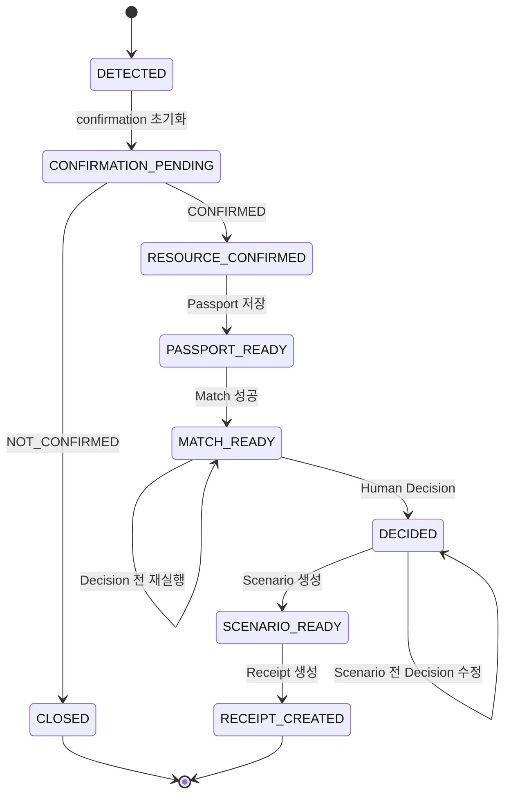

# GreenFab Loop MVP Workflow v0.1

## 1. 목적과 범위

이 문서는 Backend가 강제할 업무 상태와 전이 조건을 정의합니다. `workflow_status`는 PostgreSQL 내부의 제어 상태이며, [`data-contract.md`](./data-contract.md)의 외부 `case` 필드를 임의로 확장하지 않습니다. Frontend는 API 응답 객체의 존재 여부를 표시하되 단계 이동의 최종 권한은 Backend에 둡니다.

## 2. 상태 정의

| 내부 상태 | 의미 | 외부 Data Contract 상태 |
| --- | --- | --- |
| `DETECTED` | Detect 결과가 적재된 직후 | `case` 존재 |
| `CONFIRMATION_PENDING` | 사람의 Resource 발생 확인 대기 | `resource_confirmation.status: PENDING` |
| `RESOURCE_CONFIRMED` | 사람이 실제 발생을 확인함 | `resource_confirmation.status: CONFIRMED` |
| `PASSPORT_READY` | Passport 저장 완료 | `resource_passport` 존재 |
| `MATCH_READY` | 최신 Match와 후보 저장 완료 | `match` 존재 |
| `DECIDED` | 사람이 최종 Decision 저장 | `decision` 존재 |
| `SCENARIO_READY` | 최소 ESG Scenario 생성 완료 | `esg_scenario` 존재 |
| `RECEIPT_CREATED` | Receipt 스냅샷 생성 완료 | `receipt` 존재 |
| `CLOSED` | Resource 미발생으로 흐름 종료 | `resource_confirmation.status: NOT_CONFIRMED`, 이후 객체 `null` |

Case 적재 시 `DETECTED`를 기록한 뒤 동일 초기화 트랜잭션에서 `resource_confirmation: PENDING`과 `CASE_INITIALIZED` Audit Event를 만들고 `CONFIRMATION_PENDING`으로 전환합니다.

## 3. 정상·종료 흐름



## 4. 전이 규칙

| 현재 상태 | 명령 | 다음 상태 | 핵심 조건 | 원자적으로 저장할 항목 |
| --- | --- | --- | --- | --- |
| `DETECTED` | confirmation 초기화 | `CONFIRMATION_PENDING` | Case 적재 성공 | PENDING confirmation, `CASE_INITIALIZED` Audit Event |
| `CONFIRMATION_PENDING` | `CONFIRMED` | `RESOURCE_CONFIRMED` | 확인자 존재 | confirmation, Audit Event |
| `CONFIRMATION_PENDING` | `NOT_CONFIRMED` | `CLOSED` | 확인자 존재 | confirmation, 종료 Audit Event |
| `RESOURCE_CONFIRMED` | Passport 저장 | `PASSPORT_READY` | 설명 존재, 수량 입력 시 단위 검증 | Passport, Audit Event |
| `PASSPORT_READY` | Match 실행 | `MATCH_READY` | Passport 존재, Provider 준비 | Match Run, Candidates, Rule 결과, Audit Event |
| `MATCH_READY` | Match 재실행 | `MATCH_READY` | Decision 없음, 새 key 권장 | 새 Match Run과 Candidates, Audit Event |
| `MATCH_READY` | Decision 저장 | `DECIDED` | 후보와 사람 입력 검증 | Decision, Audit Event |
| `DECIDED` | Decision 수정 | `DECIDED` | Scenario 없음, 후보와 사람 입력 재검증 | 기존 Decision 갱신, Audit Event |
| `DECIDED` | Scenario 생성 | `SCENARIO_READY` | Decision 존재, 최소 수식 계산 가능 | Scenario, Audit Event |
| `SCENARIO_READY` | Receipt 생성 | `RECEIPT_CREATED` | 전체 연결 객체 일관성 | Receipt snapshot, Audit Event |

명시되지 않은 전이는 `409 INVALID_STATE`입니다.

## 5. 단계별 불변 조건

### Resource confirmation

- API 입력으로 허용하는 완료 값은 `CONFIRMED`, `NOT_CONFIRMED`입니다.
- `PENDING`은 초기 서버 상태이며 사용자가 완료 상태에서 되돌리는 값으로 사용하지 않습니다.
- 필수 문자열은 trim한 뒤 검증합니다. 완료 상태의 `confirmed_by`는 공백일 수 없고 `confirmed_at`과 함께 저장되며, `PENDING`에서는 두 필드가 모두 `null`입니다.
- `NOT_CONFIRMED`이면 Passport, Match, Decision, Scenario, Receipt는 `null`이어야 합니다.
- `CLOSED` Case는 일반 API로 다시 열지 않습니다. 로컬 시연에서는 `DEMO_MODE=true`와 기본 비활성인 `DEMO_RESET_ENABLED=true`를 함께 설정했을 때 Golden Case만 reset할 수 있고, 제품은 별도 재개 정책을 사용합니다.
- `ENVIRONMENT=production`에서는 `SEED_DEMO_DATA`와 `DEMO_RESET_ENABLED`가 모두 false여야 하며 그렇지 않으면 서버 설정 검증이 실패합니다.

### Resource Passport

- `CONFIRMED` 전에는 저장할 수 없습니다.
- MVP Match query를 만들 수 있도록 `description`은 비어 있지 않아야 합니다.
- `quantity`와 `unit`은 양방향 pair입니다. 둘 다 존재하거나 둘 다 `null`이어야 하며 단위만 저장할 수도 없습니다.
- `description`, `unit` 등 입력 문자열은 trim하며 필수 문자열의 공백-only 입력은 거부합니다.
- 알 수 없는 `condition`, `location`, `composition`은 `null`로 유지합니다.
- Passport 변경은 Match 실행 전 `RESOURCE_CONFIRMED`, `PASSPORT_READY`에서만 허용합니다.
- Match 이후 Passport를 바꾸려면 현재 MVP에서는 Demo reset 후 흐름을 다시 실행해야 합니다.
- Evidence binary upload는 Passport 저장 후 Decision 전인 `PASSPORT_READY`, `MATCH_READY`에서만
  허용하며 Workflow 상태를 바꾸지 않는 `PASSPORT_EVIDENCE_ADDED` Audit Event를 남깁니다.

### Match와 Rule

- Match 재실행은 Decision 전에만 허용합니다.
- 최신 성공 Match Run만 Decision 후보로 사용합니다.
- 기본 Mock 후보는 사전 생성된 고정 DEMO semantic snapshot을 사용합니다. 점수와 함께 모델명, snapshot revision을 저장하며 runtime 추론값으로 설명하지 않습니다.
- 외부 `match.created_at`은 snapshot 생성시각이 아니라 현재 Match Run의 `completed_at`입니다.
- Rule 상태 판정 우선순위는 다음과 같습니다.

```text
quantity == false 또는 location == false
→ RULE_FAIL

required_info == false 또는 missing_fields가 비어 있지 않음
→ NEEDS_INFO

그 외
→ REVIEW
```

- `null`은 조건이 설정되지 않았거나 평가 대상이 아님을 뜻할 수 있으며, `null`만으로 `NEEDS_INFO`가 되지 않습니다.
- 예를 들어 Demand에 위치 제약이 없어 `location: null`인 후보는 다른 조건을 충족하면 `REVIEW`일 수 있습니다.
- Rule status는 사람 Decision과 다르며 AI 승인 상태가 아닙니다.

### Human Decision

- `decision.status`는 `APPROVED`, `HOLD`, `REJECTED` 중 하나입니다.
- `decided_by`, `decided_at`, `reason`은 모든 Decision에 필요합니다.
- `APPROVED`는 최신 Match Run에 존재하는 `selected_demand_id`가 필요합니다.
- Backend는 Decision에 `selected_match_candidate_id`도 저장해 선택 Demand뿐 아니라 최신 Match에서 실제 검토한 후보 row를 연결합니다.
- `NEEDS_INFO` 후보는 누락정보 보완과 Match 재실행 전 승인할 수 없습니다.
- 현재 MVP에서는 `REVIEW` 후보만 `APPROVED`할 수 있습니다. Rule override는 구현하지 않습니다.
- `DECIDED` 상태이고 Scenario가 아직 없을 때는 Decision을 다시 저장할 수 있습니다. 변경도 Audit Event에 남습니다.
- Scenario 생성 뒤에는 Decision을 수정하지 않습니다. 제품 단계에서는 versioned decision 정책이 필요합니다.

### ESG Scenario

MVP는 후보 전환량만 계산합니다.

```text
APPROVED && quantity known
candidate_diversion_quantity = resource_passport.quantity

APPROVED && quantity unknown
candidate_diversion_quantity = null

HOLD or REJECTED
candidate_diversion_quantity = 0
```

- `source_type`은 `SCENARIO`입니다.
- `formula_version`은 `candidate_diversion_v0.1`입니다.
- 환산계수를 사용하지 않으므로 `factor_source`는 `null`입니다.
- 승인됐지만 수량이 `null`이면 후보 전환량도 `null`로 유지합니다. unknown을 0으로 바꾸지 않습니다.
- Scenario는 `decision_id` FK로 계산에 사용한 정확한 Decision을 연결합니다.
- 결과를 실제 회수·재활용·탄소 감축량이라고 표현하지 않습니다.

### Green Receipt

- Receipt는 `SCENARIO_READY`에서만 생성합니다.
- 생성 시점의 전체 Case envelope를 JSONB로 저장합니다.
- `decision_id`, `scenario_id` FK로 Receipt가 기록한 사람 Decision과 Scenario를 함께 연결합니다.
- 승인 흐름의 `handoff_status`는 `APPROVED`이며 실제 인계 완료를 의미하지 않습니다.
- `HANDOFF_CONFIRMED`는 물류 인계 증빙 기능이 없는 MVP에서 사용하지 않습니다.
- Receipt는 법적 인증서, 전자서명 문서 또는 불변 원장이 아닙니다.

## 6. 동시성·중복 요청

- 모든 DB 상태 변경은 대상 Case를 `SELECT ... FOR UPDATE`로 잠급니다. Match는 PENDING run/Passport hash/policy revision을 짧게 고정한 뒤 transaction 밖에서 provider inference를 실행하고, persist transaction에서 Passport와 Demand snapshot을 재검증합니다.
- Match와 Receipt는 선택적 `Idempotency-Key`를 지원하고 Client가 항상 전송하는 것을 권장합니다.
- `Idempotency-Key`는 공백 이외 문자를 포함한 1–255자여야 합니다.
- 같은 Case의 Match에서 같은 키를 재사용하면 기존 실행을 반환합니다. key 범위는 Case이므로 다른 Case에서는 같은 문자열을 사용할 수 있습니다.
- Scenario는 Case당 하나이며 `SCENARIO_READY`에서 재호출하면 기존 결과를 반환합니다.
- Receipt도 Case당 하나이고 key 범위는 Case입니다. 같은 키 또는 키 없는 재호출은 기존 Receipt를 반환합니다. 기존 Receipt가 key와 함께 생성됐는데 같은 Case에서 다른 non-null key를 사용하면 `409 RECEIPT_ALREADY_EXISTS`입니다.
- row lock과 DB Unique 제약이 같은 Case의 동시 재시도에서 중복 Match/Receipt 생성을 막습니다.

## 7. Audit Event

각 성공 전이는 최소 다음 정보를 남깁니다.

```text
case_id
event_type
actor
from_status
to_status
created_at
payload_json
```

Match의 모델명·snapshot ID 같은 실행 metadata는 `payload_json`에 명시합니다. Demo reset은 Golden Case의 기존 Audit Event를 지운 뒤 seed 과정에서 새 `CASE_INITIALIZED` Event를 남기며, 별도의 `DEMO_RESET` Event는 만들지 않습니다. Audit Event는 운영 감사 인증이 아니라 MVP 내부 추적 기록입니다.

## 8. 변경 정책

- 내부 상태나 전이 조건을 바꾸면 이 문서, API contract, migration과 테스트를 함께 수정합니다.
- 외부 JSON 필드를 추가·변경해야 하면 먼저 `data-contract.md`의 새 버전을 합의합니다.
- Frontend가 버튼을 숨기더라도 Backend의 상태 검사를 제거하지 않습니다.

## 9. 후속 TODO

- SSO/OIDC, 조직 tenant와 resource-level 권한
- Decision versioning·HOLD 재개 정책
- 실제 inference wall-clock timeout과 multi-worker 부하 제어
- Idempotency request hash와 처리 중 상태를 저장하는 범용 테이블
